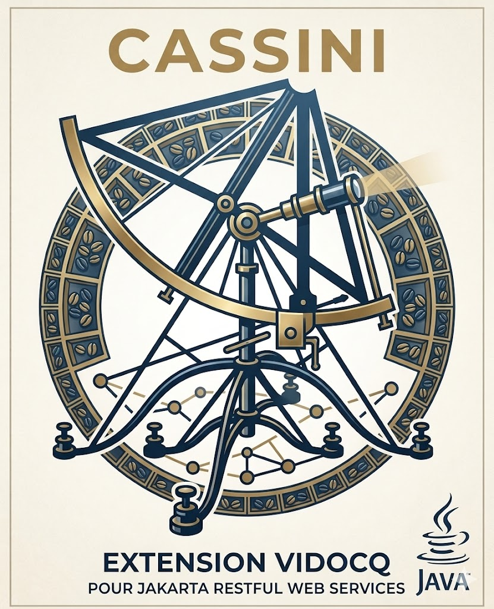
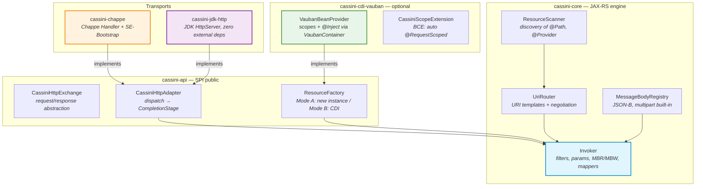
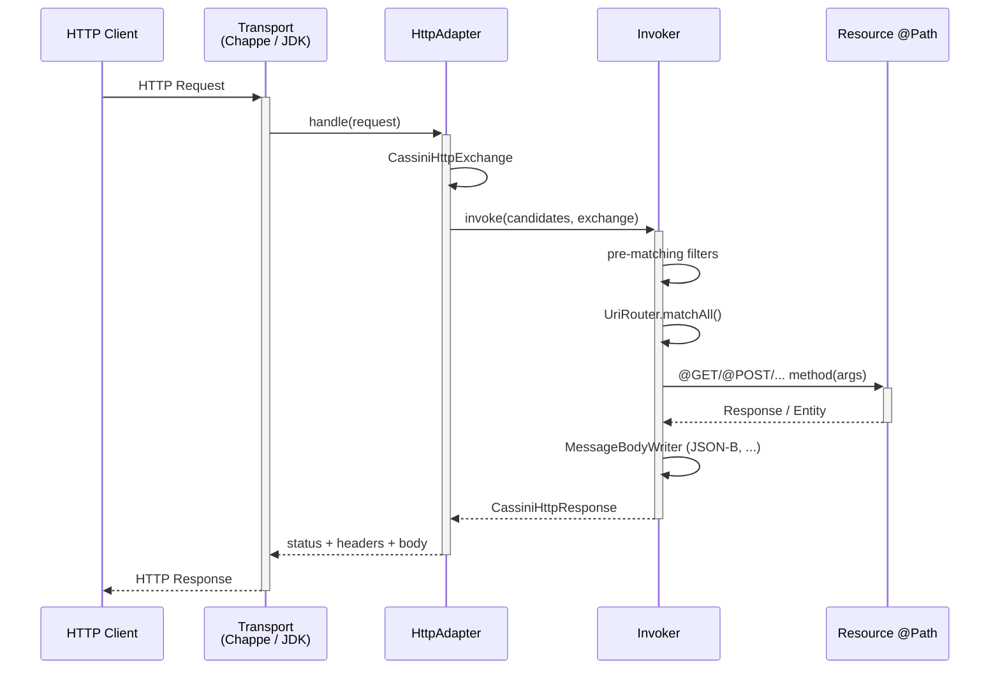

---
<p align="center">
  
</p>

<h1 align="center">Cassini</h1>

<p align="center">
  <strong>Jakarta RESTful Web Services 4.0 Implementation — transport-agnostic, native JPMS</strong><br>
  <a href="https://jakarta.ee/specifications/restful-ws/4.0/">Jakarta REST 4.0</a> | Java SE Bootstrap | Optional CDI | JDK 25
</p>

<p align="center">
  
  
  
  
  
</p>

---

## What is Cassini?

Cassini is a complete implementation of **Jakarta RESTful Web Services 4.0** (Core Profile / SE-Bootstrap) designed to be embedded in Java SE servers. It is **transport-agnostic**: the JAX-RS engine does not depend on any particular HTTP server — transport is plugged in through a lightweight SPI.

| | Jersey 4 | RESTEasy | **Cassini** |
|---|---|---|---|
| Transport | Grizzly/Jetty | Undertow | **SPI pluggable (Chappe, JDK HTTP, ...)** |
| CDI | HK2 bridge | Integrated Weld | **Optional — `BeanProvider` SPI (`cassini-cdi-vauban`, ...) or none** |
| JPMS | Partial | No | **Native (`module-info.java` complete)** |
| SE-Bootstrap | Via Grizzly | No | **Native** |
| JDK minimum | 17 | 11 | **25** |

Cassini is the REST engine of the [Vidocq](https://github.com/VidocqMP/vidocq) ecosystem.

---

## Architecture



### Request flow



---

## Modules

| Module | Role | Key dependencies |
|--------|------|------------------|
| `cassini-api` | Public SPI: `CassiniHttpExchange`, `CassiniHttpAdapter`, `ResourceFactory`, `BeanProvider` | `jakarta.ws.rs-api` only |
| `cassini-core` | Full engine: routing, route table, params, MBR/MBW, filters, SSE, codegen (`RuntimeAdapterGenerator`, `AdapterRegistry`) | `cassini-api`, `champollion-jsonp`, `champollion-jsonb` (JSON-B) |
| `cassini-client` | JAX-RS 4.0 client: zero-dep `ClientBuilder` on `java.net.http` + virtual threads | `cassini-api`, `cassini-core`, `java.net.http` |
| `cassini-cdi-vauban` | Vauban CDI adapter: `VaubanBeanProvider` (BeanProvider SPI), automatic BCE `@RequestScoped` | `cassini-api`, CDI 4.1, `io.vidocq.vauban.core` |
| `cassini-chappe` | Adapter Chappe + `ChappeRuntimeDelegate` (SE-Bootstrap) | `cassini-core`, `io.vidocq.chappe` |
| `cassini-jdk-http` | Adapter `com.sun.net.httpserver.HttpServer` (pure JDK) | `cassini-core` |
| `cassini-processor` | APT processor: generates `$$CassiniAdapter` / `$$CassiniRoutes` at compile time (AOT-safe) | `java.compiler`, `cassini-api` |
| `cassini-maven-plugin` | Maven plugin (`generate`, `process-classes`): pre-generates adapters for dependency JARs | — build-time |
| `cassini-tck` | Official Jakarta REST 4.0 TCK runner (Arquillian) | — outside the reactor |

---

## Prerequisites

```bash
# With SDKMAN! (recommended)
sdk env install    # reads .sdkmanrc → JDK 25 + Maven 3.9.16
```

```bash
# Build the reactor
./mvnw -ntp install -DskipTests
```

---

## Mode A — Standalone JDK HTTP (zero external dependency)

The lightest mode: no dependency outside the JDK. Ideal for CLI tools, integration tests, or any environment without Chappe.

### Maven dependency

```xml
<dependency>
    <groupId>io.vidocq.cassini</groupId>
    <artifactId>cassini-core</artifactId>
    <version>${cassini.version}</version>
</dependency>
<dependency>
    <groupId>io.vidocq.cassini</groupId>
    <artifactId>cassini-jdk-http</artifactId>
    <version>${cassini.version}</version>
</dependency>
```

### JAX-RS resource

```java
@Path("/hello")
public class HelloResource {

    @GET
    @Produces(MediaType.TEXT_PLAIN)
    public String hello(@QueryParam("name") @DefaultValue("world") String name) {
        return "Hello, " + name + "!";
    }

    @GET
    @Path("/{id}")
    @Produces(MediaType.APPLICATION_JSON)
    public Item getItem(@PathParam("id") long id) {
        return new Item(id, "Item #" + id);
    }

    @POST
    @Consumes(MediaType.APPLICATION_JSON)
    @Produces(MediaType.APPLICATION_JSON)
    public Response createItem(Item item) {
        // ...
        return Response.status(Response.Status.CREATED).entity(item).build();
    }
}
```

### Startup

```java
import io.vidocq.cassini.internal.ResourceScanner;
import io.vidocq.cassini.internal.UriRouter;
import io.vidocq.cassini.internal.Invoker;
import io.vidocq.cassini.jdkhttp.JdkHttpAdapter;
import com.sun.net.httpserver.HttpServer;
import java.net.InetSocketAddress;
import java.util.concurrent.Executors;

public class Main {
    public static void main(String[] args) throws Exception {
        var routes  = ResourceScanner.discover(HelloResource.class, ItemResource.class);
        var router  = new UriRouter(routes);
        var invoker = new Invoker(cls -> cls.getDeclaredConstructor().newInstance(),
                                  new MessageBodyRegistry());

        var adapter = new JdkHttpAdapter(router, invoker);
        var server  = HttpServer.create(new InetSocketAddress(8080), 0);
        server.createContext("/", adapter.asHandler());
        server.setExecutor(Executors.newVirtualThreadPerTaskExecutor());
        server.start();

        System.out.println("Cassini started on http://localhost:8080");
    }
}
```

```bash
$ curl http://localhost:8080/hello?name=Cassini
Hello, Cassini!

$ curl http://localhost:8080/hello/42
{"id":42,"name":"Item #42"}
```

---

## Mode B — SE-Bootstrap with Chappe (reference transport)

The recommended mode for production. `ChappeRuntimeDelegate` implements the **Jakarta SE-Bootstrap** standard (`SeBootstrap.start()`), making startup transport-independent and spec-compliant.

### Maven dependencies

```xml
<dependency>
    <groupId>io.vidocq.cassini</groupId>
    <artifactId>cassini-core</artifactId>
    <version>${cassini.version}</version>
</dependency>
<dependency>
    <groupId>io.vidocq.cassini</groupId>
    <artifactId>cassini-chappe</artifactId>
    <version>${cassini.version}</version>
</dependency>
<!-- Chappe transport -->
<dependency>
    <groupId>io.vidocq.chappe</groupId>
    <artifactId>chappe-core</artifactId>
    <version>${chappe.version}</version>
</dependency>
```

### JAX-RS application

```java
@ApplicationPath("/api")
public class MyApplication extends Application {

    @Override
    public Set<Class<?>> getClasses() {
        return Set.of(
            HelloResource.class,
            ItemResource.class,
            NotFoundExceptionMapper.class
        );
    }
}
```

### Startup via SE-Bootstrap

`ChappeRuntimeDelegate` is discovered automatically via ServiceLoader (JPMS `provides`).

```java
import jakarta.ws.rs.SeBootstrap;

public class Main {
    public static void main(String[] args) throws Exception {
        var config = SeBootstrap.Configuration.builder()
            .host("0.0.0.0")
            .port(8080)
            .rootPath("/")
            .build();

        SeBootstrap.start(MyApplication.class, config)
            .thenAccept(instance -> {
                var actualPort = instance.configuration().port();
                System.out.println("Cassini started on http://localhost:" + actualPort);
            })
            .toCompletableFuture()
            .join();

        Thread.currentThread().join(); // block until shutdown
    }
}
```

### Clean shutdown

```java
SeBootstrap.Instance instance = SeBootstrap.start(MyApplication.class, config)
    .toCompletableFuture().get();

// ... during shutdown
instance.stop()
    .toCompletableFuture()
    .get();
```

### Embedding in an existing Chappe server

`ChappeHttpAdapter` is a standard Chappe `Handler` — it can be registered on any mount point:

```java
import io.vidocq.cassini.chappe.ChappeHttpAdapter;

// Wiring
var routes  = ResourceScanner.discover(HelloResource.class);
var router  = new UriRouter(routes);
var invoker = new Invoker(cls -> cls.getDeclaredConstructor().newInstance(),
                          new MessageBodyRegistry());
Handler cassiniHandler = new ChappeHttpAdapter(router, invoker);

// Registration in a Chappe server
Server server = Server.builder()
    .host("0.0.0.0")
    .port(8080)
    .handler(cassiniHandler)
    .build();
server.start();
```

---

## Mode C — CDI via SPI `BeanProvider`

Cassini exposes a public SPI `io.vidocq.cassini.spi.bean.BeanProvider` that decouples the engine from any DI container. The reference adapter is `cassini-cdi-vauban` (Vauban CDI); any other adapter (Weld, OpenWebBeans, Pico, etc.) can implement the same SPI and be registered via ServiceLoader.

`CassiniStack.builder()` automatically detects the highest-priority `BeanProvider.Factory` and applies it. The builder also accepts an explicit `BeanProvider` via `.beanProvider(provider)`.

### Maven dependencies (Vauban)

```xml
<dependency>
    <groupId>io.vidocq.cassini</groupId>
    <artifactId>cassini-cdi-vauban</artifactId>
    <version>${cassini.version}</version>
</dependency>
<dependency>
    <groupId>io.vidocq.cassini</groupId>
    <artifactId>cassini-chappe</artifactId>
    <version>${cassini.version}</version>
</dependency>
<dependency>
    <groupId>io.vidocq.vauban</groupId>
    <artifactId>vauban-core</artifactId>
    <version>${vauban.version}</version>
</dependency>
```

### Resource with injection

```java
@Path("/items")
@ApplicationScoped                 // or auto @RequestScoped via CassiniScopeExtension
public class ItemResource {

    @Inject
    ItemService service;           // scoped bean injected by CDI

    @GET
    @Produces(MediaType.APPLICATION_JSON)
    public List<Item> list() { return service.findAll(); }
}
```

### Startup with Vauban + SeBootstrap

```java
import io.vidocq.vauban.core.container.VaubanContainer;
import jakarta.ws.rs.SeBootstrap;
import jakarta.ws.rs.core.Application;

public class Main {
    public static void main(String[] args) throws Exception {
        var container = VaubanContainer.builder()
                .addBeanClass(ItemService.class)
                .addBeanClass(ItemResource.class)
                .build();

        // Empty application: Cassini discovers the Vauban BeanProvider
        // via ServiceLoader and scans the container's @Path/@Provider classes.
        SeBootstrap.start(new Application() {},
                SeBootstrap.Configuration.builder().host("0.0.0.0").port(8080).build());
    }
}
```

### `CassiniScopeExtension` — auto-scope BCE

When `cassini-cdi-vauban` is on the classpath, the Build Compatible Extension `CassiniScopeExtension` automatically adds `@RequestScoped` to `@Path` classes without an explicit scope — no extra annotation required.

```java
@Path("/users")
public class UserResource {   // implicit @RequestScoped via BCE
    @Inject UserRepository repo;
    // ...
}
```

---

## JAX-RS client — `cassini-client`

`cassini-client` provides a zero-dependency `jakarta.ws.rs.client.ClientBuilder` built on `java.net.http.HttpClient` + virtual threads, discovered via `ServiceLoader`. It reuses `cassini-core`'s `MessageBodyRegistry`: JSON-B (de)serialization is shared with the server side.

```xml
<dependency>
    <groupId>io.vidocq.cassini</groupId>
    <artifactId>cassini-client</artifactId>
    <version>${cassini.version}</version>
</dependency>
```

```java
import jakarta.ws.rs.client.Client;
import jakarta.ws.rs.client.ClientBuilder;

try (Client client = ClientBuilder.newClient()) {   // resolved via ServiceLoader
    User u = client.target("https://api.example.com")
        .path("/users/{id}").resolveTemplate("id", 42)
        .request(MediaType.APPLICATION_JSON)
        .get(User.class);
}
```

Supports `ClientRequestFilter` / `ClientResponseFilter` (ordered by `@Priority`), async invocation on virtual threads (`.async().get()`), and `Feature`s auto-registered via `ServiceLoader` (e.g. MicroProfile Telemetry instrumentation, without an explicit `.register()`).

---

## Exception Mappers

```java
@Provider
public class NotFoundExceptionMapper implements ExceptionMapper<NotFoundException> {

    @Override
    public Response toResponse(NotFoundException e) {
        return Response.status(Response.Status.NOT_FOUND)
            .entity(Map.of("error", e.getMessage()))
            .type(MediaType.APPLICATION_JSON)
            .build();
    }
}
```

## Filters and interceptors

```java
@Provider
@PreMatching
public class CorsFilter implements ContainerRequestFilter {

    @Override
    public void filter(ContainerRequestContext ctx) {
        ctx.getHeaders().add("Access-Control-Allow-Origin", "*");
    }
}

@Provider
@Logged                        // @NameBinding custom
public class LoggingFilter implements ContainerRequestFilter, ContainerResponseFilter {

    @Override
    public void filter(ContainerRequestContext req) {
        System.out.printf("[→] %s %s%n", req.getMethod(), req.getUriInfo().getPath());
    }

    @Override
    public void filter(ContainerRequestContext req, ContainerResponseContext res) {
        System.out.printf("[←] %d%n", res.getStatus());
    }
}
```

---

## Jakarta REST 4.0 TCK

```
Tests run: 2670 — Pass: 2535 — Skip: 135 — Fail: 0 — Error: 0
```

Cassini conforms to the **Jakarta RESTful Web Services 4.0 / Core Profile / SE-Bootstrap** specification — certifiable TCK Process 1.4.1 score.

```bash
# Prerequisite: jakarta.ws.rs:jakarta-restful-ws-tck:4.0.1 in local M2 (non-public)

# Smoke test (quick)
./run-official-tck-restful-4.0.sh

# Full suite (~10 min)
./run-official-tck-restful-4.0.sh all

# Targeted test
./run-official-tck-restful-4.0.sh -Dtest=JAXRSClientIT
```

The 135 skipped tests cover: `servlet` (outside SE-Bootstrap), `xml_binding` (JAXB, outside Core Profile), and 6 challenges documented in [`TCK.md`](TCK.md).

---

## Roadmap

### M2h — Non-blocking async + virtual threads

- non-blocking `@Suspended AsyncResponse`
- `CompletionStage` propagated from the resource to the transport (SPI already signed)
- Native virtual threads in `cassini-chappe`
- lifecycle callbacks `addCompletionCallback` / `addConnectionCallback`
- unlocks all currently pending `@Tag("async")` tests

### M2i — Real SSE streaming *(depends on M2h)*

- Refactoring `CassiniSseEventSink` → streaming chunked push via `CassiniStreamingSink`
- unlocks the SSE challenges (`sseBroadcastTest`, `closeTest`)

---

## Build

```bash
./mvnw -ntp install            # reactor build + unit tests
./mvnw -ntp install -DskipTests  # build only
```

The `cassini-tck` module is **outside the reactor** (standalone POM Model 4.0.0) to work around a ShrinkWrap incompatibility. Use the dedicated script `./run-official-tck-restful-4.0.sh`.

---

## License

[Apache License 2.0](LICENSE)
