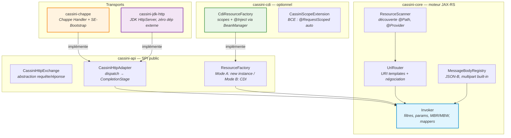
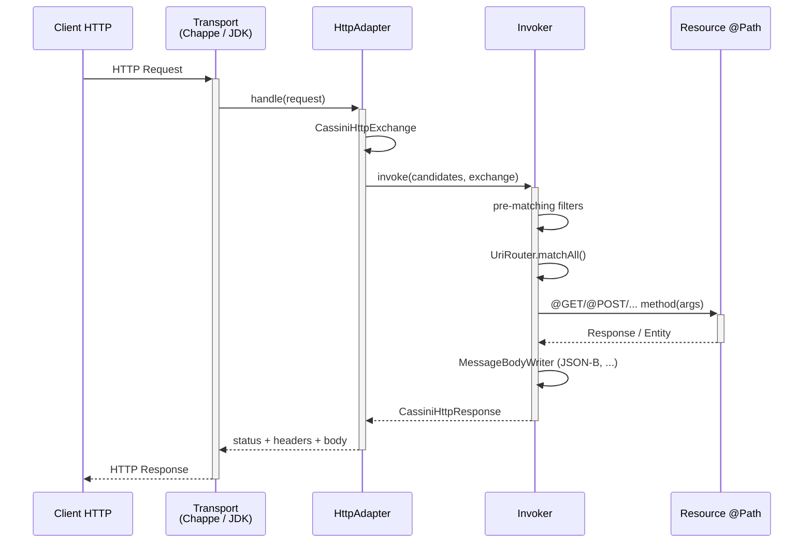

<p align="center">
  
</p>

<h1 align="center">Cassini</h1>

<p align="center">
  <strong>Implémentation Jakarta RESTful Web Services 4.0 — transport-agnostique, JPMS natif</strong><br>
  <a href="https://jakarta.ee/specifications/restful-ws/4.0/">Jakarta REST 4.0</a> | Java SE Bootstrap | CDI optionnel | JDK 25
</p>

<p align="center">
  
  
  
  
  
</p>

---

## Qu'est-ce que Cassini ?

Cassini est une implémentation complète de **Jakarta RESTful Web Services 4.0** (Core Profile / SE-Bootstrap) conçue pour être embarquée dans des serveurs Java SE. Elle est **transport-agnostique** : le moteur JAX-RS ne dépend d'aucun serveur HTTP particulier — le transport est branché via un SPI léger.

| | Jersey 4 | RESTEasy | **Cassini** |
|---|---|---|---|
| Transport | Grizzly/Jetty | Undertow | **SPI pluggable (Chappe, JDK HTTP, ...)** |
| CDI | HK2 bridge | Weld intégré | **Optionnel — `cassini-cdi` ou aucun** |
| JPMS | Partiel | Non | **Natif (`module-info.java` complet)** |
| SE-Bootstrap | Via Grizzly | Non | **Natif** |
| JDK minimum | 17 | 11 | **25** |

Cassini est le moteur REST de l'écosystème [Vidocq](https://github.com/VidocqMP/vidocq).

---

## Architecture



### Flux d'une requête



---

## Modules

| Module | Rôle | Dépendances clés |
|--------|------|------------------|
| `cassini-api` | SPI public : `CassiniHttpExchange`, `CassiniHttpAdapter`, `ResourceFactory` | `jakarta.ws.rs-api` uniquement |
| `cassini-core` | Moteur complet : routing, params, MBR/MBW, filtres, SSE | `cassini-api`, Yasson, Jakarta JSON-B |
| `cassini-cdi` | Intégration CDI : `CdiResourceFactory`, BCE `@RequestScoped` auto | `cassini-core`, CDI 4.1 |
| `cassini-chappe` | Adapter Chappe + `ChappeRuntimeDelegate` (SE-Bootstrap) | `cassini-core`, `io.vidocq.chappe` |
| `cassini-jdk-http` | Adapter `com.sun.net.httpserver.HttpServer` (JDK pur) | `cassini-core` |
| `cassini-tck` | Runner TCK officiel Jakarta REST 4.0 (Arquillian) | — hors reactor |

---

## Prérequis

```bash
# Avec SDKMAN! (recommandé)
sdk env install    # lit .sdkmanrc → JDK 25 + Maven 4.0.0-rc-5
```

```bash
# Build du reactor
./mvnw -ntp install -DskipTests
```

---

## Mode A — Standalone JDK HTTP (zéro dépendance externe)

Le mode le plus léger : aucune dépendance hors du JDK. Idéal pour les outils CLI, les tests d'intégration ou tout environnement sans Chappe.

### Dépendance Maven

```xml
<dependency>
    <groupId>io.vidocq.cassini</groupId>
    <artifactId>cassini-core</artifactId>
    <version>${cassini.version}</version>
</dependency>
<dependency>
    <groupId>io.vidocq.cassini</groupId>
    <artifactId>cassini-jdk-http</artifactId>
    <version>${cassini.version}</version>
</dependency>
```

### Resource JAX-RS

```java
@Path("/hello")
public class HelloResource {

    @GET
    @Produces(MediaType.TEXT_PLAIN)
    public String hello(@QueryParam("name") @DefaultValue("world") String name) {
        return "Hello, " + name + "!";
    }

    @GET
    @Path("/{id}")
    @Produces(MediaType.APPLICATION_JSON)
    public Item getItem(@PathParam("id") long id) {
        return new Item(id, "Article #" + id);
    }

    @POST
    @Consumes(MediaType.APPLICATION_JSON)
    @Produces(MediaType.APPLICATION_JSON)
    public Response createItem(Item item) {
        // ...
        return Response.status(Response.Status.CREATED).entity(item).build();
    }
}
```

### Démarrage

```java
import io.vidocq.cassini.internal.ResourceScanner;
import io.vidocq.cassini.internal.UriRouter;
import io.vidocq.cassini.internal.Invoker;
import io.vidocq.cassini.jdkhttp.JdkHttpAdapter;
import com.sun.net.httpserver.HttpServer;
import java.net.InetSocketAddress;
import java.util.concurrent.Executors;

public class Main {
    public static void main(String[] args) throws Exception {
        var routes  = ResourceScanner.discover(HelloResource.class, ItemResource.class);
        var router  = new UriRouter(routes);
        var invoker = new Invoker(cls -> cls.getDeclaredConstructor().newInstance(),
                                  new MessageBodyRegistry());

        var adapter = new JdkHttpAdapter(router, invoker);
        var server  = HttpServer.create(new InetSocketAddress(8080), 0);
        server.createContext("/", adapter.asHandler());
        server.setExecutor(Executors.newVirtualThreadPerTaskExecutor());
        server.start();

        System.out.println("Cassini démarré sur http://localhost:8080");
    }
}
```

```bash
$ curl http://localhost:8080/hello?name=Cassini
Hello, Cassini!

$ curl http://localhost:8080/hello/42
{"id":42,"name":"Article #42"}
```

---

## Mode B — SE-Bootstrap avec Chappe (transport de référence)

Le mode recommandé pour la production. `ChappeRuntimeDelegate` implémente le standard **Jakarta SE-Bootstrap** (`SeBootstrap.start()`), ce qui rend le démarrage indépendant du transport et conforme à la spécification.

### Dépendances Maven

```xml
<dependency>
    <groupId>io.vidocq.cassini</groupId>
    <artifactId>cassini-core</artifactId>
    <version>${cassini.version}</version>
</dependency>
<dependency>
    <groupId>io.vidocq.cassini</groupId>
    <artifactId>cassini-chappe</artifactId>
    <version>${cassini.version}</version>
</dependency>
<!-- Transport Chappe -->
<dependency>
    <groupId>io.vidocq.chappe</groupId>
    <artifactId>chappe-core</artifactId>
    <version>${chappe.version}</version>
</dependency>
```

### Application JAX-RS

```java
@ApplicationPath("/api")
public class MyApplication extends Application {

    @Override
    public Set<Class<?>> getClasses() {
        return Set.of(
            HelloResource.class,
            ItemResource.class,
            NotFoundExceptionMapper.class
        );
    }
}
```

### Démarrage via SE-Bootstrap

`ChappeRuntimeDelegate` est découverte automatiquement via ServiceLoader (JPMS `provides`).

```java
import jakarta.ws.rs.SeBootstrap;

public class Main {
    public static void main(String[] args) throws Exception {
        var config = SeBootstrap.Configuration.builder()
            .host("0.0.0.0")
            .port(8080)
            .rootPath("/")
            .build();

        SeBootstrap.start(MyApplication.class, config)
            .thenAccept(instance -> {
                var actualPort = instance.configuration().port();
                System.out.println("Cassini démarré sur http://localhost:" + actualPort);
            })
            .toCompletableFuture()
            .join();

        Thread.currentThread().join(); // bloquer jusqu'à arrêt
    }
}
```

### Arrêt propre

```java
SeBootstrap.Instance instance = SeBootstrap.start(MyApplication.class, config)
    .toCompletableFuture().get();

// ... lors de l'arrêt
instance.stop()
    .toCompletableFuture()
    .get();
```

### Embedding dans un serveur Chappe existant

`ChappeHttpAdapter` est un `Handler` Chappe standard — on peut l'enregistrer sur n'importe quel mount point :

```java
import io.vidocq.cassini.chappe.ChappeHttpAdapter;

// Wiring
var routes  = ResourceScanner.discover(HelloResource.class);
var router  = new UriRouter(routes);
var invoker = new Invoker(cls -> cls.getDeclaredConstructor().newInstance(),
                          new MessageBodyRegistry());
Handler cassiniHandler = new ChappeHttpAdapter(router, invoker);

// Enregistrement dans un serveur Chappe
Server server = Server.builder()
    .host("0.0.0.0")
    .port(8080)
    .handler(cassiniHandler)
    .build();
server.start();
```

---

## Mode C — CDI (Weld / Vauban)

`cassini-cdi` active l'injection `@Inject`, les scopes (`@RequestScoped`, `@ApplicationScoped`) et l'ajout automatique de `@RequestScoped` sur les classes `@Path` sans scope explicite.

### Dépendances Maven

```xml
<dependency>
    <groupId>io.vidocq.cassini</groupId>
    <artifactId>cassini-core</artifactId>
    <version>${cassini.version}</version>
</dependency>
<dependency>
    <groupId>io.vidocq.cassini</groupId>
    <artifactId>cassini-cdi</artifactId>
    <version>${cassini.version}</version>
</dependency>
<dependency>
    <groupId>io.vidocq.cassini</groupId>
    <artifactId>cassini-chappe</artifactId>
    <version>${cassini.version}</version>
</dependency>
<!-- Implémentation CDI (Weld SE ou Vauban) -->
<dependency>
    <groupId>org.jboss.weld.se</groupId>
    <artifactId>weld-se-core</artifactId>
    <version>6.0.x</version>
</dependency>
```

### Resource avec injection

```java
@Path("/items")
@RequestScoped                     // ou automatique via CassiniScopeExtension
public class ItemResource {

    @Inject
    private ItemService service;   // scoped bean injecté par CDI

    @GET
    @Produces(MediaType.APPLICATION_JSON)
    public List<Item> list() {
        return service.findAll();
    }

    @GET
    @Path("/{id}")
    @Produces(MediaType.APPLICATION_JSON)
    public Item get(@PathParam("id") long id) {
        return service.findById(id)
            .orElseThrow(() -> new NotFoundException("Item " + id + " introuvable"));
    }
}

@ApplicationScoped
public class ItemService {
    private final List<Item> store = new CopyOnWriteArrayList<>();

    public List<Item> findAll() { return List.copyOf(store); }

    public Optional<Item> findById(long id) {
        return store.stream().filter(i -> i.id() == id).findFirst();
    }
}
```

### Démarrage avec Weld SE

```java
import io.vidocq.cassini.cdi.CdiResourceFactory;
import org.jboss.weld.environment.se.Weld;

public class Main {
    public static void main(String[] args) throws Exception {
        // Démarrage du container CDI
        var weld = new Weld();
        var container = weld.initialize();
        var bm = container.getBeanManager();

        // Invoker CDI-aware : scopes + injection
        var invoker = Invoker.forBeanManager(bm);
        var routes  = ResourceScanner.discover(bm);   // découverte via BeanManager
        var router  = new UriRouter(routes);

        Handler handler = new ChappeHttpAdapter(router, invoker,
            action -> RequestContext.runInScope(bm, action));  // activation @RequestScoped

        Server.builder().port(8080).handler(handler).build().start();
        System.out.println("Cassini + CDI démarré sur http://localhost:8080");
    }
}
```

### `CassiniScopeExtension` — BCE auto-scope

Quand `cassini-cdi` est sur le classpath, la Build Compatible Extension `CassiniScopeExtension` ajoute automatiquement `@RequestScoped` aux classes `@Path` sans scope explicite — aucune annotation supplémentaire requise.

```java
@Path("/users")
public class UserResource {   // @RequestScoped implicite via BCE
    @Inject UserRepository repo;
    // ...
}
```

---

## Exception Mappers

```java
@Provider
public class NotFoundExceptionMapper implements ExceptionMapper<NotFoundException> {

    @Override
    public Response toResponse(NotFoundException e) {
        return Response.status(Response.Status.NOT_FOUND)
            .entity(Map.of("error", e.getMessage()))
            .type(MediaType.APPLICATION_JSON)
            .build();
    }
}
```

## Filtres et intercepteurs

```java
@Provider
@PreMatching
public class CorsFilter implements ContainerRequestFilter {

    @Override
    public void filter(ContainerRequestContext ctx) {
        ctx.getHeaders().add("Access-Control-Allow-Origin", "*");
    }
}

@Provider
@Logged                        // @NameBinding custom
public class LoggingFilter implements ContainerRequestFilter, ContainerResponseFilter {

    @Override
    public void filter(ContainerRequestContext req) {
        System.out.printf("[→] %s %s%n", req.getMethod(), req.getUriInfo().getPath());
    }

    @Override
    public void filter(ContainerRequestContext req, ContainerResponseContext res) {
        System.out.printf("[←] %d%n", res.getStatus());
    }
}
```

---

## TCK Jakarta REST 4.0

```
Tests run: 2670 — Pass: 2535 — Skip: 135 — Fail: 0 — Error: 0
```

Cassini est conforme à la spécification **Jakarta RESTful Web Services 4.0 / Core Profile / SE-Bootstrap** — score certifiable TCK Process 1.4.1.

```bash
# Pré-requis : jakarta.ws.rs:jakarta-restful-ws-tck:4.0.1 en M2 local (non-public)

# Smoke test (rapide)
./run-official-tck-restful-4.0.sh

# Suite complète (~10 min)
./run-official-tck-restful-4.0.sh all

# Test ciblé
./run-official-tck-restful-4.0.sh -Dtest=JAXRSClientIT
```

Les 135 tests ignorés couvrent : `servlet` (hors SE-Bootstrap), `xml_binding` (JAXB, hors Core Profile) et 6 challenges documentés dans [`TCK.md`](TCK.md).

---

## Roadmap

### M2h — Async non-bloquant + virtual threads

- `@Suspended AsyncResponse` non-bloquant
- `CompletionStage` propagé de la resource jusqu'au transport (SPI déjà signé)
- Virtual threads natifs dans `cassini-chappe`
- Lifecycle callbacks `addCompletionCallback` / `addConnectionCallback`
- Débloque tous les tests `@Tag("async")` actuellement en attente

### M2i — SSE streaming réel *(dépend de M2h)*

- Refactoring `CassiniSseEventSink` → push chunked au fil de l'eau via `CassiniStreamingSink`
- Débloque les challenges SSE (`sseBroadcastTest`, `closeTest`)

---

## Build

```bash
./mvnw -ntp install            # build + tests unitaires du reactor
./mvnw -ntp install -DskipTests  # build seul
```

Le module `cassini-tck` est **hors reactor** (POM Model 4.0.0 standalone) pour contourner une incompatibilité ShrinkWrap. Utiliser le script dédié `./run-official-tck-restful-4.0.sh`.

---

## Licence

[Apache License 2.0](LICENSE)
